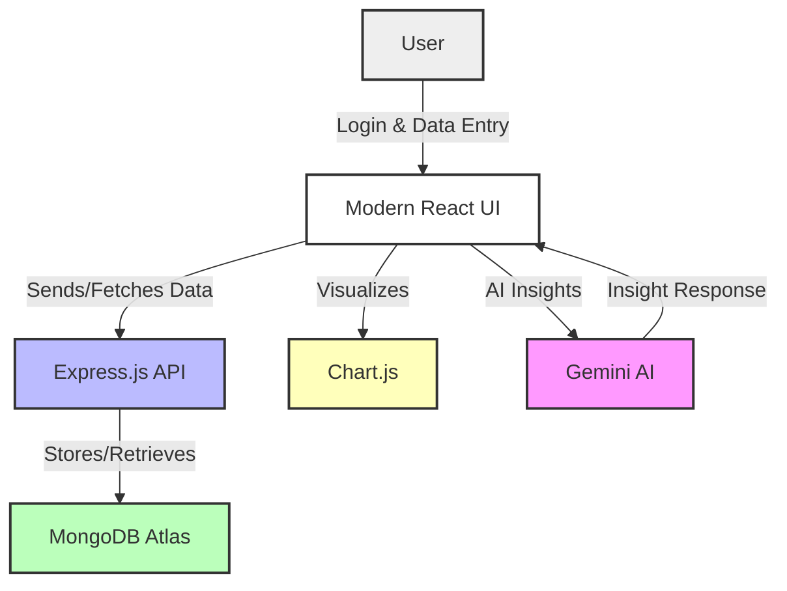

# 📊 Sales Analysis Dashboard

A full-stack MERN (MongoDB, Express, React, Node.js) project for tracking and analyzing sales data with beautiful data visualization using **Chart.js** and AI-powered insights from **Gemini**.


---

## 🚀 Features

- 📈 **Interactive Sales Data Charts**: Visualize sales, profit, and inventory trends with dynamic Chart.js graphs.
- 🤖 **AI-Generated Insights**: Instantly get smart, concise business insights for your charts using Google Gemini AI.
- 🗃️ **Cloud Database**: All data is securely stored and managed in MongoDB Atlas.
- 🧮 **Inventory Management**: Add, update, and track product inventory in real time.
- 🔐 **Secure & Modular Backend**: Built with Express.js and Node.js for robust API and data handling.
- ⚛️ **Modern UI**: Responsive, user-friendly interface built with React.js.
- 🌐 **RESTful API**: Smooth integration between frontend and backend.
- 📊 **Real-Time Analytics**: Instantly see the impact of your data changes in charts and tables.
- 🔥 **Easy Deployment**: Ready for Vercel (frontend) and Render (backend) cloud deployment.

---

## 🖼️ Project Architecture



---

## 🛠️ Local Development Setup

> **Note**: Make sure [Node.js](https://nodejs.org/) and [MongoDB Atlas](https://www.mongodb.com/cloud/atlas) are set up. Use `.env` to securely store DB URI.

### 1. Clone the Repository

```bash
git clone https://github.com/7-sanjay/Sales-Analysis-Dashboard.git

```
### Open Frontend
```bash
cd frontend
```
### Install necessary libraries
```bash
npm install axios firebase react-chartjs-2 
```
### Run Frontend
```bash
npm start
```
### Open Backend
```bash
cd backend
```
### Install Backend lib
```bash
npm install express mongoose body-parser cors dotenv nodemon nodemailer
```

### Run the Server
```bash
node server.js
```

### Email Alerts Configuration

Add these variables to your backend `.env` to enable low-stock email alerts:

```
# Mongo / existing
MONGODB_URI=...

# Email alerts
ALERT_EMAIL_FROM="Alerts <no-reply@example.com>"
ALERT_EMAIL_TO="you@example.com"
SMTP_HOST=smtp.example.com
SMTP_PORT=587
SMTP_USER=your_smtp_username
SMTP_PASS=your_smtp_password
SMTP_SECURE=false

# Optional thresholds and cooldowns
LOW_STOCK_THRESHOLD=3
LOW_STOCK_ALERT_COOLDOWN_MS=21600000    # 6 hours
OUT_OF_STOCK_ALERT_COOLDOWN_MS=86400000 # 24 hours
```

Alerts are triggered when inventory is created/updated or when stock is reduced. Low stock alerts fire when stock is > 0 and <= threshold; out-of-stock alerts fire when stock is 0. Cooldowns prevent duplicate emails.


