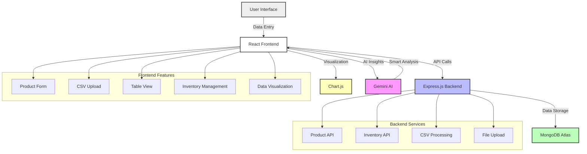

# 📊 Sales Analysis Dashboard

A comprehensive full-stack MERN (MongoDB, Express, React, Node.js) application for tracking and analyzing sales data with beautiful data visualization using **Chart.js** and AI-powered insights from **Gemini**.


---

## 🚀 Features

### 📊 **Data Management**
- **Product Management**: Add, edit, and track product sales data with comprehensive form validation
- **CSV Import**: Bulk import products from CSV files with drag-and-drop functionality
- **Inventory Management**: Real-time inventory tracking with stock level monitoring
- **Data Visualization**: Interactive charts and graphs for sales analysis

### 🎯 **User Interface**
- **Responsive Design**: Works seamlessly on desktop, tablet, and mobile devices
- **Modern UI**: Clean, intuitive interface with gradient designs and smooth animations
- **Side-by-Side Layout**: Form and CSV upload on the same page for efficient workflow
- **Table View**: Comprehensive data table with sorting, filtering, and bulk operations

### 🔧 **Advanced Functionality**
- **Row Selection**: Select individual or multiple rows for bulk operations
- **Bulk Delete**: Delete selected rows with confirmation dialogs
- **Real-time Updates**: Instant data synchronization across all views
- **Error Handling**: Comprehensive error handling with user-friendly messages

### 📈 **Analytics & Insights**
- **Interactive Charts**: Dynamic visualizations using Chart.js
- **AI-Powered Insights**: Smart business insights using Google Gemini AI
- **Sales Analytics**: Track sales, profit, and inventory trends
- **Export Functionality**: Download data as CSV files

### 🛡️ **Security & Performance**
- **Cloud Database**: Secure data storage with MongoDB Atlas
- **RESTful API**: Well-structured backend API with Express.js
- **Input Validation**: Comprehensive form validation and data sanitization
- **Optimized Performance**: Efficient data handling and rendering

---

## 🖼️ Project Architecture



---

## 🛠️ Local Development Setup

> **Prerequisites**: [Node.js](https://nodejs.org/) and [MongoDB Atlas](https://www.mongodb.com/cloud/atlas) account

### 1. Clone the Repository

```bash
git clone https://github.com/7-sanjay/Sales-Analysis-Dashboard.git
cd Sales-Analysis-Dashboard
```

### 2. Backend Setup

```bash
cd Backend
npm install
```

Create a `.env` file in the Backend directory:

```env
MONGODB_URI=your_mongodb_atlas_connection_string
PORT=5000
```

### 3. Frontend Setup

```bash
cd Frontend
npm install
```

Create a `.env` file in the Frontend directory:

```env
REACT_APP_API_BASE_URL=http://localhost:5000
```

### 4. Run the Application

**Start Backend Server:**
```bash
cd Backend
npm start
```

**Start Frontend Development Server:**
```bash
cd Frontend
npm start
```

The application will be available at:
- **Frontend**: http://localhost:3000
- **Backend API**: http://localhost:5000

---

## 📁 Project Structure

```
Sales-Analysis-Dashboard/
├── Backend/
│   ├── models/
│   │   ├── Product.js          # Product data model
│   │   └── Inventory.js        # Inventory data model
│   ├── routes/
│   │   ├── products.js         # Product API routes
│   │   └── inventory.js        # Inventory API routes
│   ├── uploads/                # Temporary CSV file storage
│   ├── server.js               # Main server file
│   └── package.json
├── Frontend/
│   ├── src/
│   │   ├── Components/
│   │   │   ├── FormPage/       # Product form and CSV upload
│   │   │   ├── TableView/      # Data table with bulk operations
│   │   │   ├── Inventory/      # Inventory management
│   │   │   └── Visualization/  # Charts and analytics
│   │   ├── App.js
│   │   └── index.js
│   └── package.json
└── README.md
```

---

## 🎯 Key Features Explained

### 📝 **Product Management**
- **Add Products**: Comprehensive form with category selection, product details, and automatic calculations
- **Edit Products**: Update existing product information with real-time inventory adjustments
- **Bulk Import**: Upload multiple products via CSV files with validation and error reporting

### 📊 **Table View**
- **Responsive Table**: All columns fit within screen width without horizontal scrolling
- **Row Selection**: Checkbox-based selection for individual or bulk operations
- **Bulk Delete**: Delete multiple selected rows with confirmation
- **Export Data**: Download table data as CSV files

### 📦 **Inventory Management**
- **Stock Tracking**: Real-time inventory monitoring with visual indicators
- **Category Filtering**: Filter products by category for easy management
- **Stock Updates**: Edit product prices, net prices, and stock quantities
- **Low Stock Alerts**: Visual indicators for products with low inventory

### 📈 **Data Visualization**
- **Interactive Charts**: Dynamic graphs showing sales trends and analytics
- **AI Insights**: Smart analysis and recommendations using Gemini AI
- **Real-time Updates**: Charts update automatically when data changes

---

## 🔧 API Endpoints

### Products
- `GET /api/products` - Get all products
- `POST /api/products` - Create new product
- `PUT /api/products/:id` - Update product
- `DELETE /api/products/:id` - Delete single product
- `DELETE /api/products` - Delete all products
- `POST /api/upload-csv` - Upload and process CSV file

### Inventory
- `GET /api/inventory` - Get all inventory items
- `POST /api/inventory` - Add/update inventory item
- `PUT /api/inventory/:id` - Update inventory item
- `DELETE /api/inventory/:id` - Delete inventory item
- `POST /api/inventory/reduce` - Reduce stock quantity

---

## 🚀 Deployment

### Frontend (Vercel)
1. Connect your GitHub repository to Vercel
2. Set environment variables in Vercel dashboard
3. Deploy automatically on push to main branch

### Backend (Render/Railway)
1. Connect your GitHub repository
2. Set environment variables (MONGODB_URI, PORT)
3. Deploy and get your backend URL
4. Update frontend environment variables with backend URL

---

## 🛡️ Security Features

- **Input Validation**: All user inputs are validated and sanitized
- **Error Handling**: Comprehensive error handling with user-friendly messages
- **File Upload Security**: Secure CSV file processing with validation
- **Database Security**: MongoDB Atlas with secure connection strings

---

## 📱 Responsive Design

The application is fully responsive and optimized for:
- **Desktop**: Full feature set with side-by-side layouts
- **Tablet**: Adapted layouts with touch-friendly interfaces
- **Mobile**: Stacked layouts with optimized touch interactions

---

## 🤝 Contributing

1. Fork the repository
2. Create a feature branch (`git checkout -b feature/AmazingFeature`)
3. Commit your changes (`git commit -m 'Add some AmazingFeature'`)
4. Push to the branch (`git push origin feature/AmazingFeature`)
5. Open a Pull Request

---

## 📄 License

This project is licensed under the MIT License - see the [LICENSE](LICENSE) file for details.

---

## 👨‍💻 Author

**Sanjay** - [GitHub](https://github.com/7-sanjay)

---

## 🙏 Acknowledgments

- [Chart.js](https://www.chartjs.org/) for beautiful data visualizations
- [Google Gemini AI](https://ai.google.dev/) for intelligent insights
- [MongoDB Atlas](https://www.mongodb.com/cloud/atlas) for cloud database
- [React](https://reactjs.org/) and [Express.js](https://expressjs.com/) communities